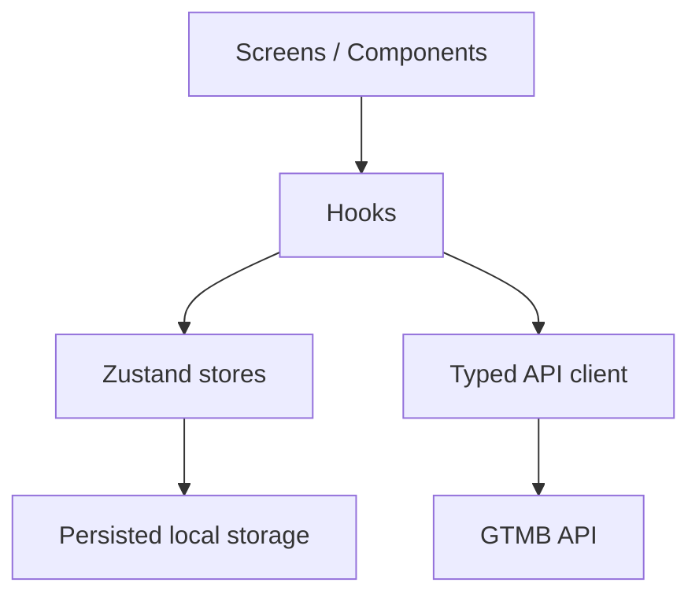

# Architecture

## Overview

The app is organized around a thin route layer, reusable UI/mortgage components, typed data access, and explicit state ownership. Routes under `src/app` should only compose hooks and components. Business/UI behavior lives under `src/components`, `src/hooks`, `src/store`, and `src/api`.

## Data Flow

Dashboard and detail screens read applications through `useApplications` and `useApplication`.

In mock mode, `useApplicationsStore` is the source of truth so locally saved drafts are reflected immediately in the dashboard. When a backend is connected, the same shape can be hydrated from API responses and reconciled with pending local writes.

## State Ownership

- Server/application state: `useApplicationsStore` for the current mock implementation; API wrappers in `src/api` define the future backend boundary.
- UI state: `useUIStore` owns dashboard search/filter/modal state.
- Draft form state: `useNewApplicationStore` owns persisted field values and `lastSavedAt`.
- Auth state: `useAuthStore` owns access/refresh tokens and writes them to SecureStore.
- Validation state: React Hook Form owns touched/error state, using Zod schemas from `src/lib/schemas`.

## API Client

`src/api/client.ts` centralizes:

- Base URL and API key configuration.
- Bearer token injection.
- Timeout handling.
- Retry on network and 5xx failures with backoff/jitter.
- Token refresh queuing to avoid duplicate refresh calls.
- Normalized `ApiError` objects for callers.
- Development log redaction for sensitive keys.

Endpoint modules should call the typed `api.get/post/put/patch/delete` helpers instead of importing Axios directly.

## Offline Support At Scale

The current app persists drafts and application data locally. A production offline model would add:

- An `outboxStore` for pending mutations.
- Idempotency keys for draft saves, submissions, withdrawals, and messages.
- Mutation metadata: operation type, payload, created time, retry count, and last error.
- Network listener that replays queued mutations when connectivity returns.
- Conflict handling when server state has changed while offline.
- Optimistic UI with rollback for rejected server writes.
- Server-generated revision/version fields to detect stale updates.

## Data Integrity

- Input validation is defined with Zod and surfaced through React Hook Form.
- Monetary fields remain strings while the user types, then are parsed into kobo at boundaries.
- Application objects use typed status and mortgage-type unions.
- API errors are normalized so UI components do not branch on raw Axios/server shapes.

## Security Tradeoffs

- Tokens are stored in SecureStore.
- API logs redact common financial/auth sensitive fields.
- Current drafts are persisted with AsyncStorage for Expo Go compatibility. Production should encrypt draft payloads, reduce sensitive fields stored locally, or use native encrypted storage.
- BVN/NIN/PIN/OTP/card data should never be logged and should be masked in UI by default.
- Access tokens should be short-lived; refresh tokens should be rotated and revocable.

## Component Boundaries

- `AppHeader` is the single green header component for dashboard and inner screens.
- `ProgressStepper` is shared by the new application flow and mortgage workflow stepper.
- `DropdownField`, `FormField`, `AlertBanner`, `StatusBadge`, and `Button` expose explicit props and carry validation/error presentation consistently.
